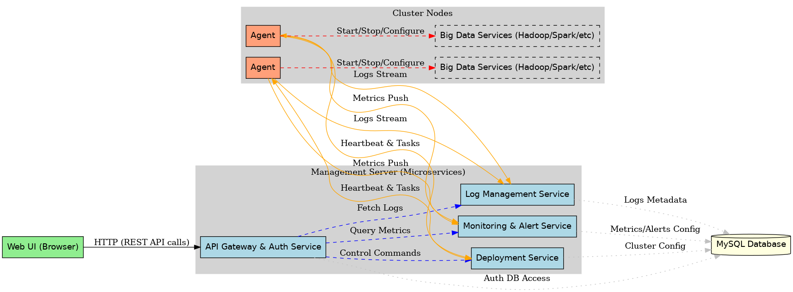

# 大数据集群管理平台

这是一个模仿Cloudera Manager的大数据集群管理平台，用于简化大数据集群的部署、配置、监控和管理。

## 系统架构

系统由以下主要组件构成：

- **管理服务器**：核心管理组件，包含多个微服务
  - API网关 & 认证服务：处理API请求，用户认证和权限验证
  - 部署服务：负责组件的安装部署和配置
  - 监控告警服务：收集和分析监控指标，触发告警
  - 日志管理服务：收集和展示各服务日志
- **Agent代理**：部署在每个集群节点上，执行管理服务器下发的指令
- **Web UI**：用户界面，通过调用REST API与系统交互
- **MySQL数据库**：存储系统元数据和配置信息



## 功能特性

- 集群部署与扩缩容：支持HDFS、YARN、Spark、Hive、Kafka等组件的一键部署
- 监控与告警：实时监控集群状态，支持自定义告警规则
- 日志管理：集中查看和分析各组件日志
- 权限管理：基于RBAC的细粒度权限控制

## 技术栈

- 后端：Go语言微服务
- 前端：React SPA
- 数据库：MySQL
- 通信：REST API, gRPC

## 快速开始

### 前置条件

- Go 1.18+
- MySQL 8.0+
- Node.js 16+

### 安装与运行

1. 克隆代码库
   ```
   git clone https://github.com/TejParker/bigdata-manager.git
   cd bigdata-manager
   ```

2. 配置数据库
   ```
   mysql -uroot -p < config/schema.sql
   ```

3. 启动管理服务器
   ```
   go run cmd/server/main.go
   ```

4. 在集群各节点上部署并启动Agent
   ```
   go run cmd/agent/main.go -server=<管理服务器地址> -id=<主机ID>
   ```

5. 启动前端开发服务器
   ```
   cd ui
   npm install
   npm start
   ```

6. 访问Web界面
   ```
   http://localhost:3000
   ```

## 开发与贡献

请参考[开发文档](./docs/development.md)了解如何参与开发和贡献代码。

## 许可证

[MIT](./LICENSE) 